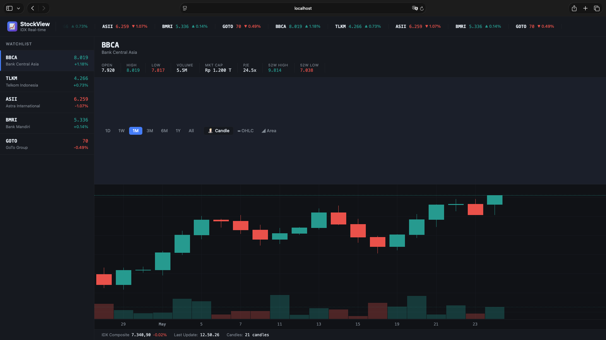
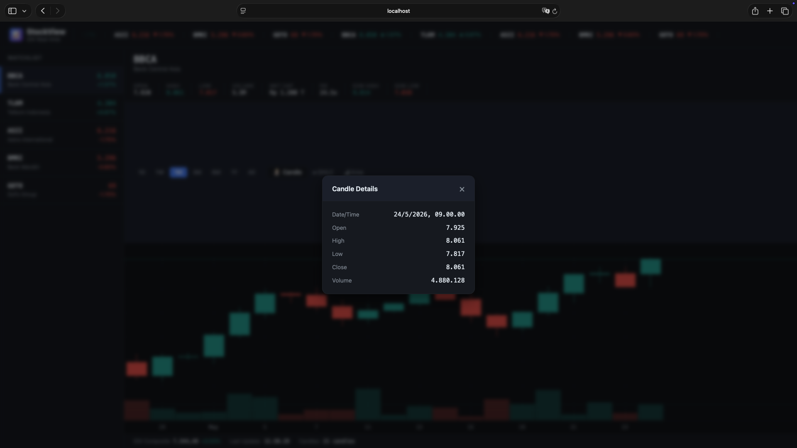

# StockView — Candlestick Chart




Real-time stock candlestick chart untuk saham menggunakan Go + TradingView Lightweight Charts.

## Fitur

- **Candlestick Chart** interaktif dengan library TradingView Lightweight Charts v4
- **5 Saham IDX**: BBCA, TLKM, ASII, BMRI, GOTO
- **Live Update** setiap 1 detik — background goroutine mensimulasikan pergerakan harga
- **Multiple Chart Types**: Candlestick, OHLC Bar, Area
- **Timeframe Filter**: 1D, 1W, 1M, 3M, 6M, 1Y, All
- **Volume Histogram** di bagian bawah chart
- **Crosshair Tooltip & Click Modal** dengan detail OHLCV
- **Ticker Bar** berjalan otomatis di header
- **Dark Theme** profesional ala terminal trading

## Struktur Project (Flat Architecture)

```
stockchart/
├── main.go       — server, data store, generator, handlers, semua dalam satu file
├── index.html    — HTML template dengan embedded CSS & JS
├── go.mod        — Go module definition
└── README.md
```

## Cara Menjalankan

### Prasyarat
- Go 1.18+ terinstall

### Langkah

```bash
# Clone / ekstrak project
cd stockchart

# Jalankan server
go run main.go

# atau build dulu lalu run
go build -o stockchart .
./stockchart
```

Buka browser: **http://localhost:8080**

## API Endpoints

| Endpoint | Method | Keterangan |
|---|---|---|
| `/` | GET | Halaman utama chart |
| `/api/candles?symbol=BBCA` | GET | Data candle historis (JSON) |
| `/api/latest` | GET | Data terbaru semua saham + candle terakhir |

## Arsitektur

- **In-memory store** dengan `sync.RWMutex` untuk thread safety
- **Background goroutine** berjalan setiap 1 detik mensimulasikan pergerakan harga
- **SSE-less polling**: frontend polling `/api/latest` setiap 1 detik
- Data historis 200 hari dibuat saat startup dengan random walk

## Catatan

> Data yang ditampilkan adalah **simulasi** dan bukan data pasar nyata.
> Aplikasi ini tidak dimaksudkan sebagai saran investasi.
